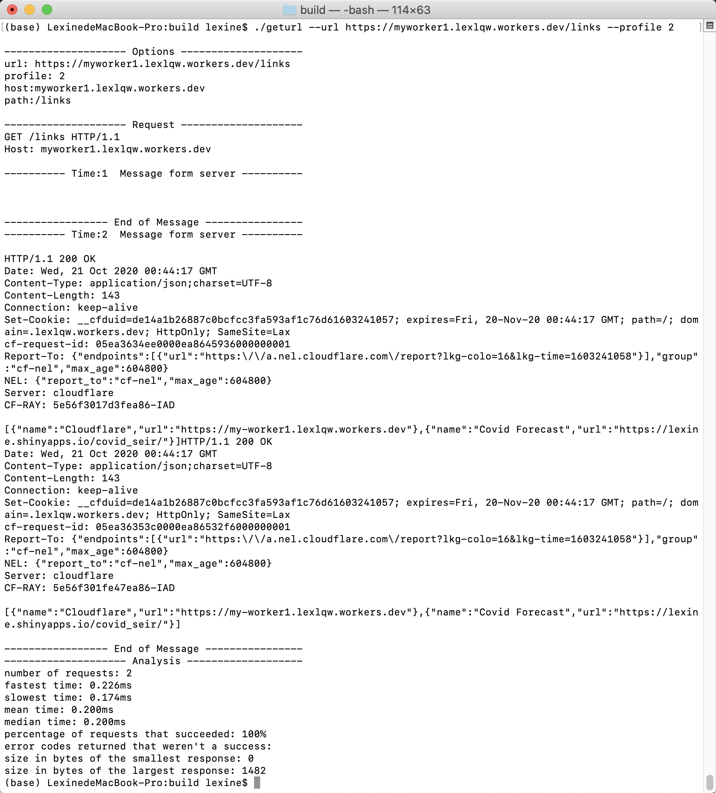
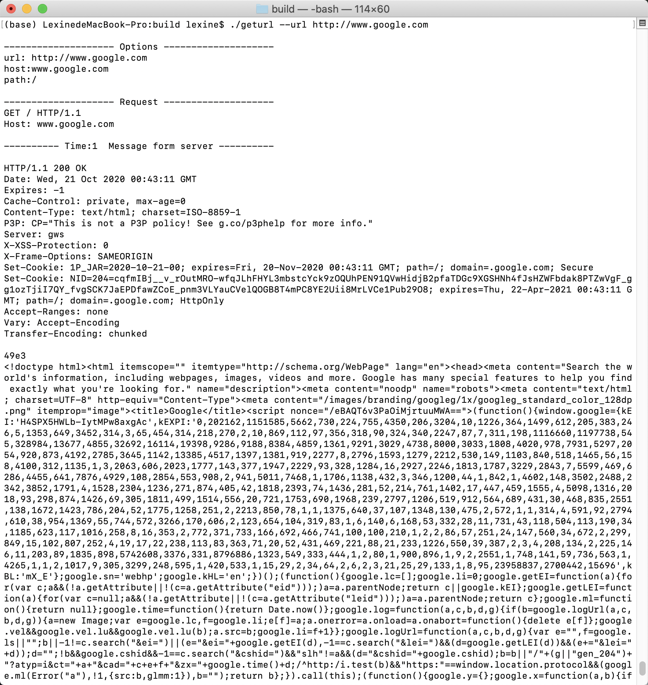
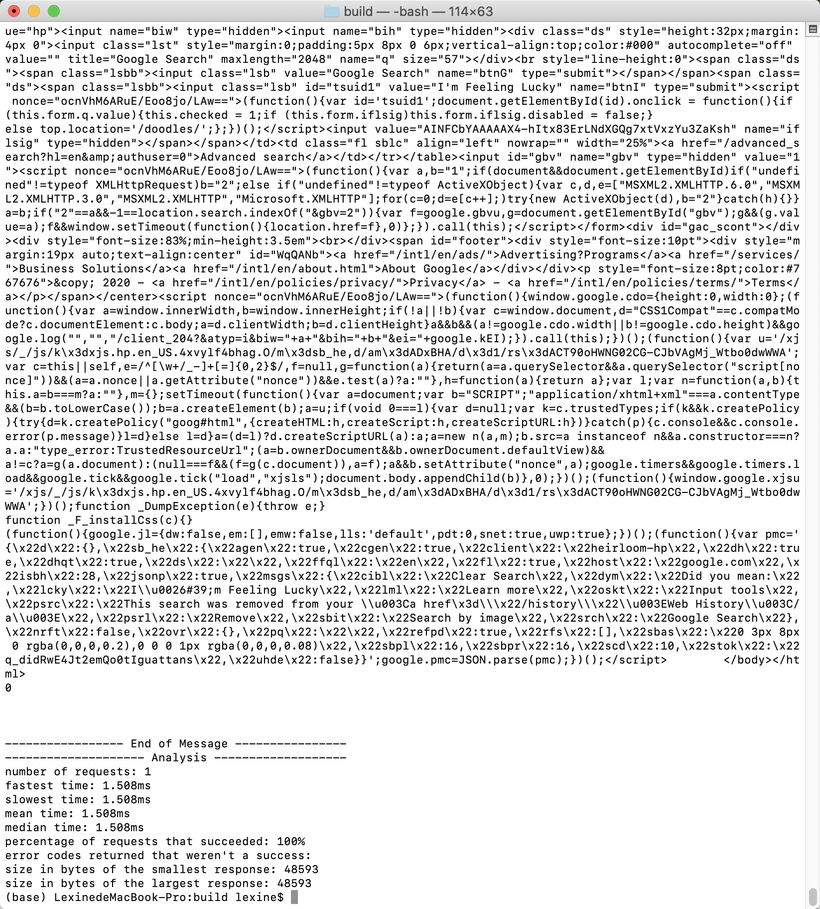

# c-socket-request
Use socket to make request to websites
#### Download
```
git clone https://github.com/qli74/c-socket-request
cd c-socket-request
```
#### Install
 ```
mkdir build
cd buid
cmake ..
make
 ```
#### Usage
This tool uses socket to make requests to a given url.

 -u --url       destination url 
 
 -p --profile   number of requests (default: 1)
 
 -n --port      port number (default: 80)
 
 -t --maxtime      max wait time(ms) (default: 150)
 
 -h --help      help information
#### Example
 ```
 ./geturl -u http://myworker1.lexlqw.workers.dev/links -p 5 -n 80
 ```
 ```
 ./geturl --url https://www.google.com --profile 5 --port 80 
 ```
 
 
 

#### Test
1. GET http://myworker1.lexlqw.workers.dev/links
* number of requests: 100
* fastest time: 0.243ms
* slowest time: 0.111ms
* mean time: 0.187ms
* median time: 0.190ms
* percentage of requests that succeeded: 100%
* error codes returned that weren't a success: 
* size in bytes of the smallest response: 741
* size in bytes of the largest response: 741

2. GET http://www.google.com
* number of requests: 100
* fastest time: 1.594ms
* slowest time: 0.763ms
* mean time: 1.025ms
* median time: 0.991ms
* percentage of requests that succeeded: 100%
* error codes returned that weren't a success: 
* size in bytes of the smallest response: 48491
* size in bytes of the largest response: 49365
